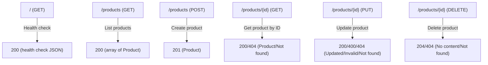

# Products Backend API Documentation

This document provides OpenAPI/Swagger-based documentation for the Products Backend REST API, which allows you to create, read, update, and delete product information.

## Accessing the API Documentation

The Products Backend exposes interactive API documentation using Swagger UI.  
**Swagger UI is available at:**  
[https://vscode-internal-783-qa.qa01.cloud.kavia.ai:3001/docs](https://vscode-internal-783-qa.qa01.cloud.kavia.ai:3001/docs)

The raw OpenAPI/Swagger specification can be found at:  
[https://vscode-internal-783-qa.qa01.cloud.kavia.ai:3001/openapi.json](https://vscode-internal-783-qa.qa01.cloud.kavia.ai:3001/openapi.json)

---

## Overview

- **Base URL:** The API base URL matches the host/port Swagger UI is served from.
- **Content-Type:** All requests and responses use `application/json`.

---

## Endpoints Summary

### Health Check

`GET /`

- **Description:** Check the health/status of the service.
- **Responses:**
  - `200 OK`
    ```
    {
      "status": "ok",
      "message": "Service is healthy",
      "timestamp": "2024-05-18T10:12:34.567Z",
      "environment": "development"
    }
    ```

---

### Products CRUD API

#### 1. Get All Products

`GET /products`

- **Description:** Retrieve an array of all products.
- **Responses:**
  - `200 OK`: Array of `Product` objects.
    ```json
    [
      {
        "id": "1716038906719",
        "name": "Sample Product",
        "price": 19.99,
        "description": "A demo product."
      }
    ]
    ```

#### 2. Get One Product

`GET /products/{id}`

- **Path Parameter:**
  - `id` (string, required): Product id.
- **Responses:**
  - `200 OK`: Returns a `Product`.
    ```json
    {
      "id": "1716038906719",
      "name": "Sample Product",
      "price": 19.99,
      "description": "A demo product."
    }
    ```
  - `404 Not Found`:
    ```json
    {"message": "Product not found."}
    ```

#### 3. Create Product

`POST /products`

- **Request Body:** `ProductInput`
  ```json
  {
    "name": "New Product",
    "price": 42.50,
    "description": "A brand new product"
  }
  ```
- **Responses:**
  - `201 Created`: Returns the created `Product` (with assigned unique `id`).
  - `400 Bad Request`: Invalid input.
    ```json
    {"message": "Product \"name\" is required."}
    ```

#### 4. Update Product

`PUT /products/{id}`

- **Path Parameter:**
  - `id` (string, required): Product id.
- **Request Body:** Fields to update (`ProductInput`)
- **Responses:**
  - `200 OK`: Returns updated `Product`.
  - `400 Bad Request`: Invalid input.
  - `404 Not Found`: Not found.

#### 5. Delete Product

`DELETE /products/{id}`

- **Path Parameter:**
  - `id` (string, required): Product id.
- **Responses:**
  - `204 No Content`: Product successfully deleted.
  - `404 Not Found`:
    ```json
    {"message": "Product not found."}
    ```

---

## Schemas

### Product

```json
{
  "id": "string",
  "name": "string",
  "price": 0,
  "description": "string"
}
```

- `id` (string): Unique product ID (system-assigned).
- `name` (string): Name of the product (required).
- `price` (number): Product price (required).
- `description` (string): Product description (optional).

### ProductInput

```json
{
  "name": "string",
  "price": 0,
  "description": "string"
}
```
- Used for create/update.  
- `name` and `price` are required.

---

## Example API Calls

### Create a Product

**Request**
```http
POST /products
Content-Type: application/json

{
  "name": "Laptop",
  "price": 799.00,
  "description": "High-performance laptop"
}
```

**Response**
```http
201 Created
Content-Type: application/json

{
  "id": "1716038963435",
  "name": "Laptop",
  "price": 799.00,
  "description": "High-performance laptop"
}
```

### Update a Product

**Request**
```http
PUT /products/1716038963435
Content-Type: application/json

{
  "name": "Gaming Laptop",
  "price": 950.00
}
```

**Response**
```http
200 OK
{
  "id": "1716038963435",
  "name": "Gaming Laptop",
  "price": 950.00,
  "description": "High-performance laptop"
}
```

---

## OpenAPI/Swagger Specification

The API follows the [OpenAPI 3.0.0 Specification](https://swagger.io/specification/).  
A JSON OpenAPI document describing all endpoints, schemas, parameters, and response codes is available in:
- `products_backend/interfaces/openapi.json`
- Downloadable at `/openapi.json` (see URL above).

---

## How to Access Swagger UI

1. Start the backend server (`npm start` or as configured).
2. Open [https://vscode-internal-783-qa.qa01.cloud.kavia.ai:3001/docs](https://vscode-internal-783-qa.qa01.cloud.kavia.ai:3001/docs) in your browser.
3. Use the interactive documentation to try all API endpoints, see schemas, and view live responses.

---

## Updating the API Documentation

- Edit `products_backend/interfaces/openapi.json` for spec changes.
- JSDoc-style Swagger annotations are also present in `src/routes/products.js` and `src/routes/index.js`.

---

## Mermaid Diagram: API Endpoints Overview



---

## Further Reading

- See the Swagger UI (`/docs`) for live examples, parameter descriptions, and models.
- For code references, see implementation in:
  - `src/routes/products.js`
  - `src/controllers/product.js`
  - `src/services/product.js`
  - `interfaces/openapi.json`

---
